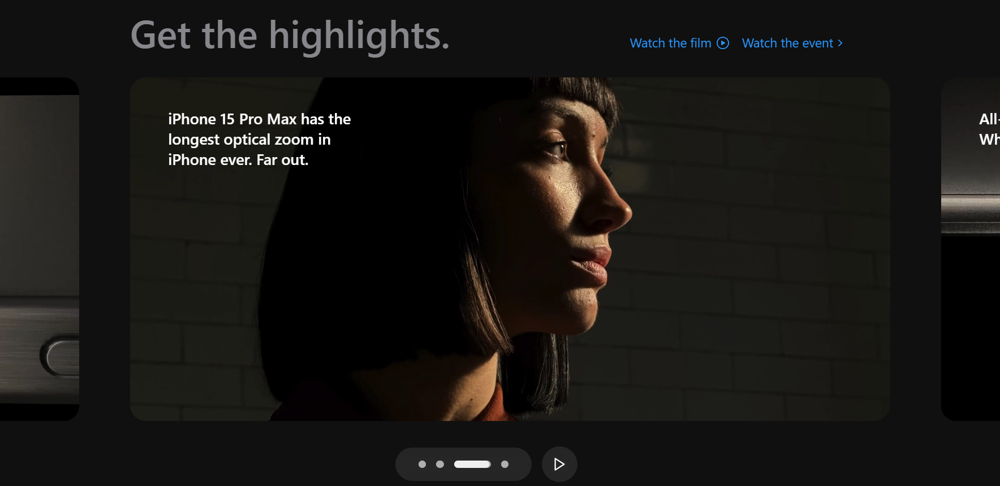
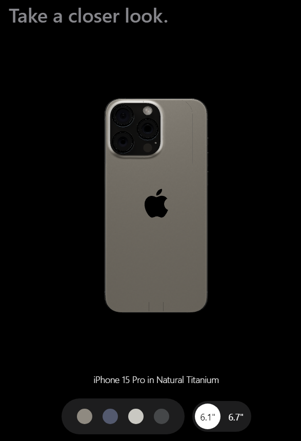

# Apple Website Clone

## Project Overview

This repository contains the first stage of developing an Apple website clone using **React** and **Tailwind CSS**. The project is initialized with **Vite** for its speed and simplicity, providing a modern development environment.


<br>

## Stage 06: Implement 3d model view Component  
**Log Date:** January 9, 2025  

This stage focuses on implementing the Video Carousel component to showcase video content interactively.


<hr>
<br>

### Step-by-Step Process


#### 1. Model Component Implementation  

- Build a basic model section 

👉 [View the updated `Model.jsx` Component](./src/components/model3d/Model.jsx)

**Note:**  
You can see the changes in real time during the development phase.

<br>

<hr>

#### 2. Model View Component Implementation  

- Build a basic Model View section 

👉 [View the updated `ModelView.jsx` Component](./src/components/model3d/ModelView.jsx)

**Note:**  
You can see the changes in real time during the development phase.

<br>

<hr>


#### 3. install three js for __

- 

npm install three @react-three/drei @react-three/fiber
<br>

<hr>

#### 4. Add Lights component
 // group different lights and lightformers. We can use group to organize lights, cameras, meshes, and other objects in the scene.
- 
👉 [View the updated `Lights.jsx` Component](./src/components/model3d/Lights.jsx)
<br>

<hr>

#### 5. Add Iphone jsx component

- 🎮 Turns GLTFs into JSX components. use this repo
  ```https://github.com/pmndrs/gltfjsx```

upload assets/models/scene.glb and convert. then
  copy that converted jsx code and paste to IPhone.jsx in the component section
👉 [View the updated `IPhone.jsx` Component](./src/components/model3d/IPhone.jsx)
<br>

<hr>


### Run the Application  
After completing the above steps:  
1. Run the development server using the command:  
   ```bash
   npm run dev
    ```
2. Open the local development server in your browser:<br>
    ex: Local: ```http://localhost:{port#}/```

<br>
<hr>

#### Stage 5 Screenshot : Basic Impl Video Carousel
 

<hr>
See you in the next step for the development process! 🚀


