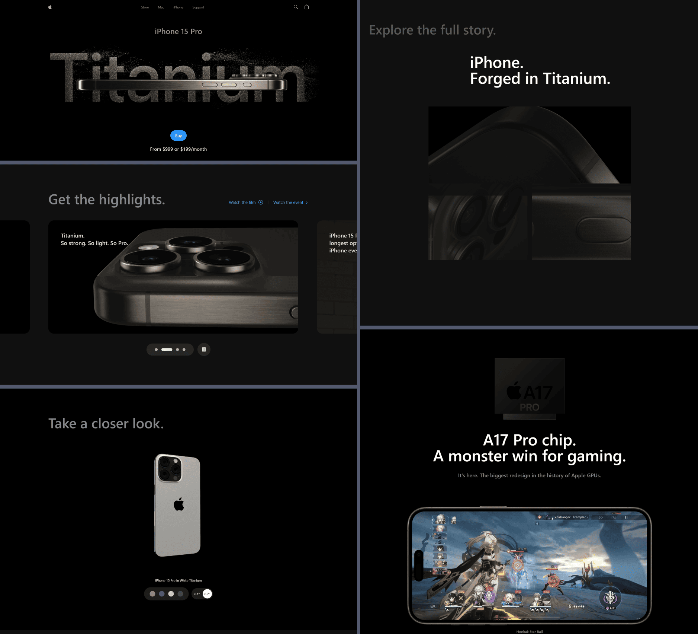

<h1 align="center" >  Apple iPhone 15 Website Clone  <br> ♨ [ ʀᴇᴀᴄᴛ ᴘʀᴏᴊᴇᴄᴛ ] ♨</h1>

## ɪ  ⁃  ᴘʀᴏᴊᴇᴄᴛ ɪɴꜰᴏ 

This repository is a **frontend-only** clone of Apple’s iPhone 15 Pro website, built with **React.js** and **TailwindCSS**, and powered by **Vite** for a fast and modern development experience.  

> [!Note]
> This project aims to replicate the look and feel of the original website, showcasing the design and animations without functional backend elements.  

<br>

<div align="center">

⁃ ᴄᴏɴᴛᴇɴᴛꜱ ⁃  
[ᴀᴘᴘ ꜱᴄʀᴇᴇɴꜱ](#ɪɪ--ᴠɪꜱᴜᴀʟ-ᴛᴏᴜʀ-ᴏꜰ-ᴛʜᴇ-ᴀᴘᴘ-ꜱᴄʀᴇᴇɴꜱ)
| [ᴅᴇᴠ ꜰᴇᴀᴛᴜʀᴇꜱ](#ɪɪɪ--ʙᴇʜɪɴᴅ-ᴛʜᴇ-ᴄᴏᴅᴇ-ᴅᴇᴠ-ꜰᴇᴀᴛᴜʀᴇꜱ)
| [ᴘʀᴏᴊᴇᴄᴛ ʙʀᴀɴᴄʜᴇꜱ](#ᴠ--ᴘʀᴏᴊᴇᴄᴛ-ʙʀᴀɴᴄʜᴇꜱ)
| [ᴘʀᴏᴊᴇᴄᴛ ɴᴏᴛᴇꜱ](#ᴠɪ--ᴘʀᴏᴊᴇᴄᴛ-ɴᴏᴛᴇꜱ)


  <div>
    
    
    
    
  </div>

<br>

</div>

## ɪɪ ⁃ ᴠɪꜱᴜᴀʟ ᴛᴏᴜʀ ᴏꜰ ᴛʜᴇ ᴀᴘᴘ: ꜱᴄʀᴇᴇɴꜱ

<p align="center">

</p>


## ɪɪɪ ⁃ ʙᴇʜɪɴᴅ ᴛʜᴇ ᴄᴏᴅᴇ: ᴅᴇᴠ ꜰᴇᴀᴛᴜʀᴇꜱ

### ⭓ Features

👉 **Beautiful Smooth Animations with GSAP**: Elevate the user experience with seamless and captivating animations.  

👉 **3D Model Rendering in Various Colors and Sizes**: Interact with dynamic 3D models of the iPhone 15 Pro, displayed in multiple colors and sizes using Three.js.  

👉 **Custom Video Carousel (GSAP)**: A unique and interactive video carousel designed to engage users and enhance browsing.  

👉 **Completely Responsive Design**: Optimized for every screen size, delivering a consistent experience across all devices.  

👉 **Showcases UI/UX Excellence**: Focused entirely on frontend design and user interactions, with no backend or functional features implemented.  

👉 **Reusable and Clean Code Architecture**: Built with reusability and maintainability in mind for seamless project scaling.  


<br>

### ⭓ Technologies Used  
- **React.js**: Component-based structure for building the UI.  
- **Three.js**: Rendering 3D models and effects.  
- **React Three Fiber**: Simplified Three.js integration in React.  
- **React Three Drei**: Helper components for easier 3D development.  
- **GSAP (GreenSock)**: Creating fluid and engaging animations.  
- **Vite**: Modern development environment for blazing-fast builds.  
- **Tailwind CSS**: For fast, responsive, and modern styling.  

<br>


## 🚀 Quick Start  

Follow these steps to set up the project on your local machine.  

### Prerequisites  

Ensure you have the following installed:  
- [Git](https://git-scm.com/)
- [Node.js](https://nodejs.org/en)
- [npm](https://www.npmjs.com/) (Node Package Manager)

### Clone the Repository  

```bash
git clone https://github.com/NovaLogics/apple-react-web-app.git
cd apple-react-web-app
```

### Install Dependencies
Use npm to install the required dependencies:

```bash
npm install
```

### Run the Project
Start the development server:
```bash
npm run dev
```
Then, open `http://localhost:5173` in your browser to see the project in action.

<br>
<hr>


> [!Note]
> Build for Production  
> If you need a production-ready build, run:<br>
> > npm run build

<hr>

## ᴠ ⁃ ᴘʀᴏᴊᴇᴄᴛ ʙʀᴀɴᴄʜᴇꜱ

<!-- Main / Master / Production Branch -->

> <samp> **PRODUCTION BRANCH :**  </samp>  
> Stable code for deployment  
> ➲ [main][branch-main]


> <samp> **DEVELOPMENT BRANCH :**  </samp>   
> Active codebase for ongoing development efforts  (New features, bug fixes, and improvements..)  
> ➲ [dev-current][branch-development]

<br>

#### ➲ Code from the scratch
Explore the branches: Stage 1–9

##### Branches  

1. [**dev-stage-1-init_project**](https://github.com/NovaLogics/apple-react-web-app/tree/dev-stage-1-init_project)  
   Initial project setup.  

2. [**dev-stage-2-add_resource**](https://github.com/NovaLogics/apple-react-web-app/tree/dev-stage-2-add_resource)  
   Added required resources.  

3. [**dev-stage-3-init_development**](https://github.com/NovaLogics/apple-react-web-app/tree/dev-stage-3-init_development)  
   Initialized development environment.  

4. [**dev-stage-4-impl_components**](https://github.com/NovaLogics/apple-react-web-app/tree/dev-stage-4-impl_components)  
   Implemented core UI components.  

5. [**dev-stage-5-impl_video_carousel**](https://github.com/NovaLogics/apple-react-web-app/tree/dev-stage-5-impl_video_carousel)  
   Developed the video carousel feature.  

6. [**dev-stage-6-impl_3d_model**](https://github.com/NovaLogics/apple-react-web-app/tree/dev-stage-6-impl_3d_model)  
   Added 3D model rendering functionality.  

7. [**dev-stage-7-impl_device_features**](https://github.com/NovaLogics/apple-react-web-app/tree/dev-stage-7-impl_device_features)  
   Implemented the "Device Features" section.  

8. [**dev-stage-8-impl_feat_how_it_works**](https://github.com/NovaLogics/apple-react-web-app/tree/dev-stage-8-impl_feat_how_it_works)  
   Added the "How It Works" section.  

9. [**dev-stage-9-impl_section_footer**](https://github.com/NovaLogics/apple-react-web-app/tree/dev-stage-9-impl_section_footer)  
   Implemented the footer section.  


[branch-main]:  https://github.com/NovaLogics/apple-react-web-app/tree/main

[branch-development]:  https://github.com/NovaLogics/apple-react-web-app/tree/dev-current

<br>

## ᴠɪ ⁃ ᴘʀᴏᴊᴇᴄᴛ ɴᴏᴛᴇꜱ

N/A
