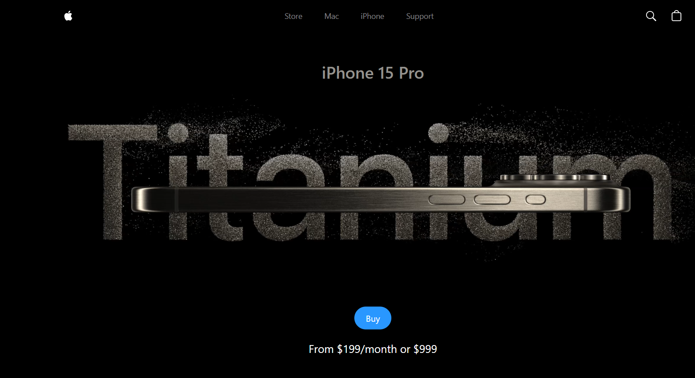

# Apple Website Clone

## Project Overview

This repository contains the first stage of developing an Apple website clone using **React** and **Tailwind CSS**. The project is initialized with **Vite** for its speed and simplicity, providing a modern development environment.


<br>

## Stage 03: Add Components  
**Log Date:** January 8, 2025  

This stage focuses on adding and configuring custom components to structure the application layout and functionality.

<hr>
<br>

### Step-by-Step Process

#### 1. Add Custom Components  
- Create a new `components` folder inside the `src` directory.  
- Inside the `components` folder:  
  - Create a `Navbar.jsx` file.  
  - Create a `Hero.jsx` file.  
  - Create a `Highlights.jsx` file.  

👉 [View the `src/components` folder](./src/components/)

**Note:**  
Install the `'ES7+ React/Redux/React-Native snippets'` plugin.  
Using the `rafce` snippet will generate interactive component templates quickly.

<hr>

#### 2. Import Component Files to `App.jsx`  
- Integrate the newly created components into `App.jsx`.  

👉 [View the updated `App.jsx`](./src/App.jsx)

**Note:**  
Now you can run the application to see the changes.

<hr>

#### 3. Basic Navbar Implementation  
- Build a basic Navbar component to display in the application.  

👉 [View the updated Navbar Component](./src/components/Navbar.jsx)

**Note:**  
You can see the changes in real time during the development phase.


<hr>


#### 4. Install GSAP for Animations  

- Install the GSAP animation library by running the following command in the terminal:  
  ```bash
  npm install gsap @gsap/react
  ```

After installation, you can import the GSAP modules as follows:

import gsap from "gsap"; <br>
import { useGSAP } from "@gsap/react";

Note: <br>
GSAP will be used to add animations to components in later stages.

<hr>

#### 5. Basic Hero Component Implementation
 
- Build a basic Hero section to showcase content prominently.  

👉 [View the updated `src/components/Hero` Component](./src/components/Hero.jsx)

**Note:**  
You can see the changes in real time during the development phase.

<hr>

### Run the Application  
After completing the above steps:  
1. Run the development server using the command:  
   ```bash
   npm run dev
    ```
2. Open the local development server in your browser:<br>
    ex: Local: ```http://localhost:{port#}/```

<hr>

#### Stage 3 Screenshot


<hr>
See you in the next step for the development process! 🚀


